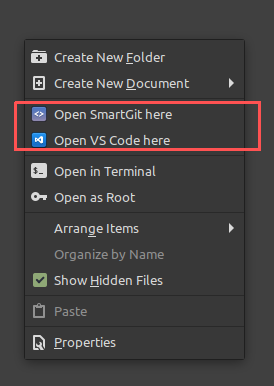

Ok, now that I got your click with that title I got to say that many people say that "10x developers" don't exist, instead, this post should be titled "How to be a great developer" or "How to increase performance/productivity as a developer" but then you would have not clicked. 😉

### Table of Contents

1. [Use ZSH](#use-zsh)
1. [Use AI](#use-ai)
1. [Learn and use shortcuts](#learn-and-use-shortcuts)
1. [Get a mouse with extra buttons](#get-a-mouse-with-extra-buttons)
1. [Learn how to type faster](#learn-how-to-type-faster)
1. [Create alias](#create-alias)
1. [Add extra entries to your context menus](#add-extra-entries-to-your-context-menus)
1. [Use bookmarks](#use-bookmarks)
1. [Use extensions](#use-extensions)
1. [Keep up with the industry](#keep-up-with-the-industry)
1. [Use TTS (text-to-speech)](#use-tts-text-to-speech)
1. [Use voice assistants](#use-voice-assistants)
1. [Learn about security and stay secure](#learn-about-security-and-stay-secure)
1. [Stay healthy](#stay-healthy-)
1. [Learn/Use Linux](#learnuse-linux)
1. [Don’t give up](#dont-give-up)
1. [Contribute to Open Source](#contribute-to-open-source)
1. [Reps](#reps)
1. [Share your knowledge](#share-your-knowledge)
1. [Learn about tangential things](#learn-about-tangential-things)
1. [Use Grammarly](#use-grammarly)
1. [Get a rubber duck](#get-a-rubber-duck-🦆)
1. [Learn new stuff every day](#learn-new-stuff-every-day)

Here is my list of tips/tricks to be a great developer:

### Use ZSH

"[oh my zsh!](https://ohmyz.sh/)" to be more precise, you will never go back to bash! It's that good! It gives you themeable prompts (I use the [powerlevel10k](https://github.com/romkatv/powerlevel10k) theme), advanced command history, spelling correction (case insensitive), great autocomplete, plugins (git, node, npm, etc). The git plugin immediately tells you the branch, working tree status, origin, and much more!

### Use AI

Yes, AI! Artificial intelligence.
Harness its power to help you code faster. It's like having a second pair of hands. 👐🏻

I'm talking about [Kite](https://kite.com/) the "AI Coding Assistant for Python and JavaScript". It's awesome how it predicts what you want to write, it will blow your mind! 🤯 Try it!

### Learn and use shortcuts

Learn all the shortcuts you can, from your code editor to your browser and other developer tools. After that create shortcuts for things you do often. Use [AutoKey](https://www.autohotkey.com/) to make your own. I, for example, have my Numpad `-` key set to:

```python
keyboard.send_keys("git cz")
keyboard.send_keys("<enter>")
```

So that I can do a commit with 1 key click. How awesome is that!? (and that key is physically red).

### Get a mouse with extra buttons

You don't need an expensive mouse, any random mouse that has the 2 extra Back and Forward buttons works, [here it is one for less than 3€](https://aliexpress.com/item/32958566594.html). These extra buttons will allow you to navigate (Back and Forward) on Web Browsers and File Browsers much faster by not having to move the mouse to the top left corner and clicking Back/Forward.

### Learn how to type faster

In the same vein as learning the shortcuts you should be a fast typer, learn how to use all the fingers and how to touch type, it can save you hours, the math is quite easy, if you spend 8 hours typing (coding) and now you are twice as fast typing, the same work will take 4 hours.
[This is a great site to practice.](https://www.keybr.com/)

### Create alias

Like I mentioned before, you can create shortcuts in the command line those are called `alias`. If you are using ZSH you got a huge collection of them already.

Here are some of my favourite ones:

```bash
alias gac="git add . && git commit"
alias gs="git status"
alias gp="git push --all -u"
alias grep='grep --color=auto'
alias c="code ."
alias py="nodemon --quiet --exec 'clear && python3'"
alias www='xdg-open http://127.0.0.1:8000/ && python -m SimpleHTTPServer 8000'

```

To make an alias add: `alias gs="git status"` to your `.zshrc` or `.bashrc` accordingly.

### Add extra entries to your context menus

Ok, this one is very specific but I thought it would help. Do you know those menus that show up when you right-click on a folder?

I've added these 2 extra entries to be able to navigate faster. They allow me to open VS Code way faster.

### Use bookmarks

Both on your file manager to quickly get to your most-used folders and in your browser to quickly get to your most-used URLs.

Just press **CTRL + D**, hopefully, your web browser and file browser support this feature.

When I say URLs I mean not only sites, you can bookmark `chrome://inspect/#devices` or `localhost:8000`. This last one combined with that previous alias that makes a local server is golden! You can also remove the text and it will display only the icon! 🤯

### Use extensions

This applies both to your code editor and browser. There are extensions for everything nowadays and they make your life much better!

Let me highlight some of my favorites:

#### Browser:

- [The Great Suspender](https://chrome.google.com/webstore/detail/the-great-suspender/klbibkeccnjlkjkiokjodocebajanakg)
- [Honey](https://www.joinhoney.com/ref/iq07d3m)
- [Tampermonkey](https://chrome.google.com/webstore/detail/tampermonkey/dhdgffkkebhmkfjojejmpbldmpobfkfo)
- [LastPass](https://chrome.google.com/webstore/detail/lastpass-free-password-ma/hdokiejnpimakedhajhdlcegeplioahd)
- [Dark Reader](https://chrome.google.com/webstore/detail/dark-reader/eimadpbcbfnmbkopoojfekhnkhdbieeh)

#### VS Code:

- [Bracket Pair Colorizer 2](https://marketplace.visualstudio.com/items?itemName=CoenraadS.bracket-pair-colorizer-2)
- [Prettier - Code formatter](https://marketplace.visualstudio.com/items?itemName=esbenp.prettier-vscode)
- [Code Spell Checker](https://marketplace.visualstudio.com/items?itemName=streetsidesoftware.code-spell-checker)
- [Re-run Last Command](https://marketplace.visualstudio.com/items?itemName=Cameron.rerun-last-command)

I've written a blog post detailing [all the extensions I use and why.](https://blog.rodrigograca.com/the-visual-studio-code-extensions-i-use-full-stack-developer-why/)

### Keep up with the industry

- Listen to podcasts
- Subscribe/Watch YouTube videos
- Read technology news
- Read what people are saying on Twitter
- Read the CHANGELOG/RELEASE NOTES of your tools
- Read blogs 😉

### Use TTS (text-to-speech)

There are extensions, sites, and even SaaS all at your disposal to turn boring text into audio.
I use and love [narro.co](https://www.narro.co/), it turns any article into audio and gives you a podcast feed as output. That means you have a custom podcast where each episode is an article you chose turned into audio so that you can listen later while doing other misc tasks (cooking, cleaning).

### Use voice assistants

If you are using your hands just ask your voice assistant for what you need. For example, many times if I know a website is going to ask for a 2FA code I will ask Google to open my 2FA app ([Authy](https://authy.com/)) while I start opening the site and logging in, then when it asks me for the code I have it already displaying on my phone.

### Learn about security and stay secure

You can't be a good developer if you make insecure software. [Safety is number one priority](https://www.youtube.com/watch?v=nIbZX0b608s) 😂. You have to know at least the basics of how an attacker could attack your code: user input validation, rate limiting, password hashing, defaults, not trustable/needed dependencies, don't use Windows, XSS, SQLI, etc.

I've written an entire blog post on [how to stay secure as a developer.](https://blog.rodrigograca.com/how-to-stay-secure-as-a-developer/)

### Stay healthy 🏃🏻💪🏻

- Exercise (good blood circulation is important to think and perform better)
- Sleep. [Sleep is your superpower!](https://www.youtube.com/watch?v=5MuIMqhT8DM)
- Eat healthily. Avoid carbs and sugar.
- Supplement with Omega 3 for the 🧠 and Vitamin D3 for "everything else"
- Do intermittent fasting

(I will write a blog post just about this topic, stay tuned!)

### Learn/Use Linux

Learn how to use the command line because sooner or later you will have to debug something on a server if you want to grow as a developer. If you intend to do any DevOps you will need to know Linux. I use Linux Mint 19.3 (soon to be 20)

### Don't give up

Being a better developer is all about digging deeper until you find the root problem and solving it there. Don't just open an issue on GitHub or StackOverflow and wait for others to solve your problems, jump from file to file and find the cause of the problem, then solve it for your self and contribute any changes back to the community.

### Contribute to Open Source

Don't just take, contribute something back. Create your own or help with others' code. Seeing how other code something will make you grow so much!

### Reps!

Put the reps in! Just like with exercise you got to put the repetitions in. You got to repeat things every single day! Code every day, learn every day.

### Share your knowledge

Like I'm doing 😉. Jokes aside, make a blog, or just share with others on Twitter/Slack what you just learned, from small tips like shortcuts to huge concepts, do it and you will see huge benefits, not only is proven that sharing makes you smarted but your peers will thank you for it and everyone will grow.

### Learn about tangential things

From how graphic drivers work to hardware to how networks work you should know more than just about the programming language you are working. Sometimes the problem might be somewhere else like the network.

### Use Grammarly

As a non-native English speaker Grammarly has been a life-saving utility!
If you don't know Grammarly is an automated grammar checker.

### Get a rubber duck 🦆

In case you don't know there's a method called [Rubber duck debugging](https://en.wikipedia.org/wiki/Rubber_duck_debugging) that consists of you explaining your code line-by-line to the duck when you are stuck trying to solve a problem. (Any other inanimate objects or pets such as a dog or a cat works too! 🐈)

> Insights are often found by simply describing the problem aloud.

### Learn new stuff every day

Learning is a lifelong process. You should be learning something every single day.

That said: Keep reading my blog 😉
