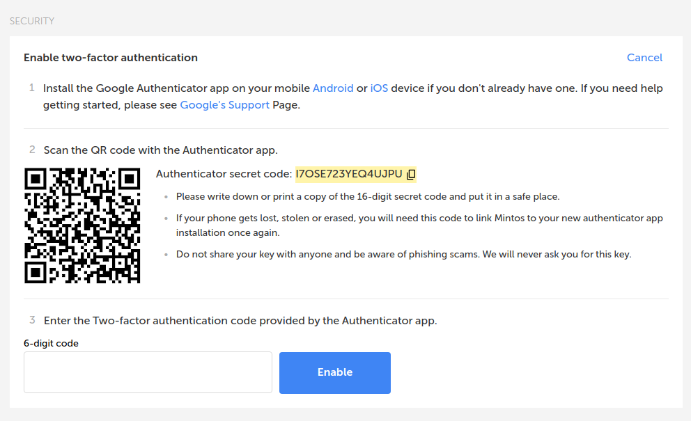
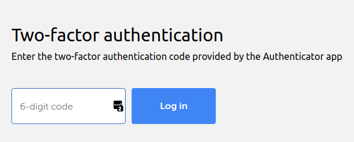
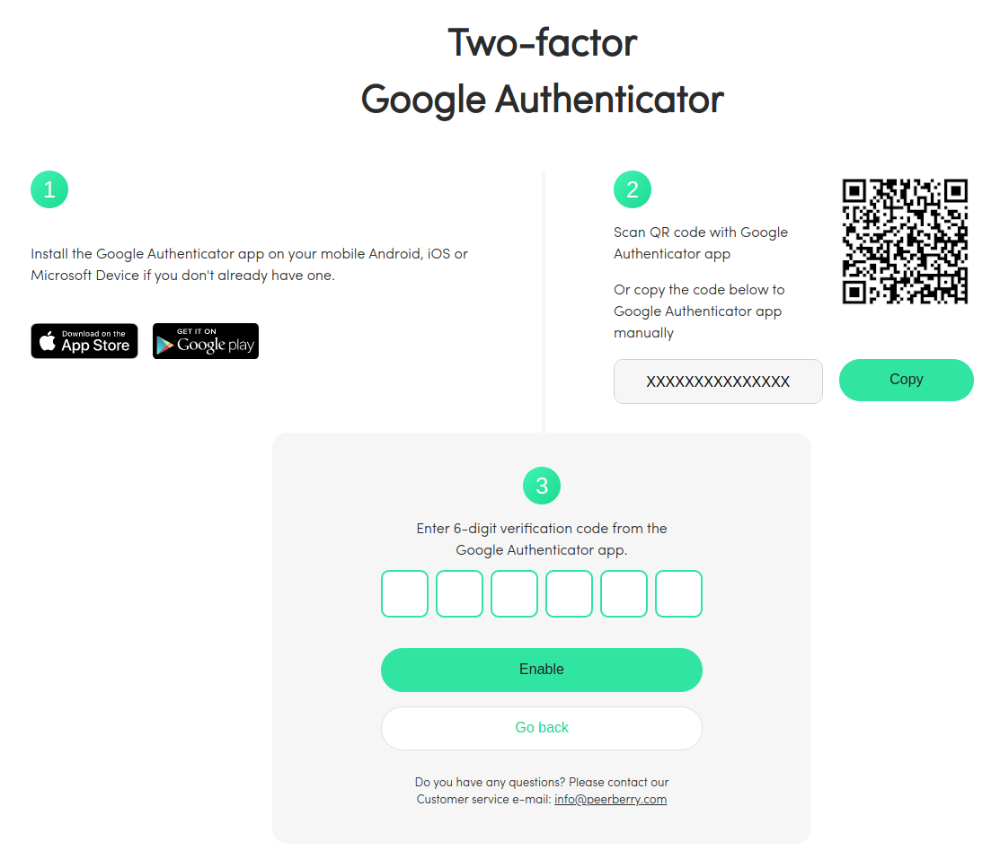
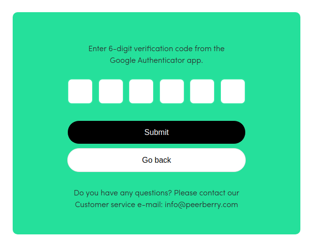
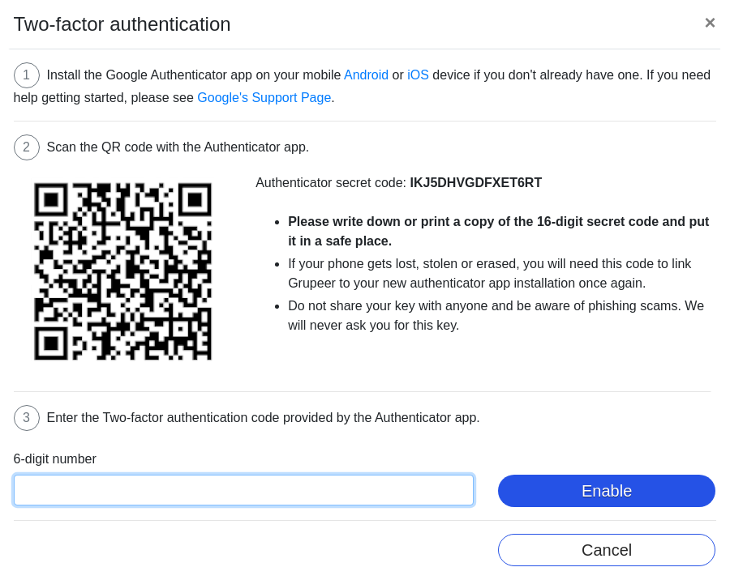
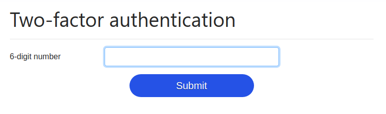

Security is of utmost importance, especially when it comes to dealing with money. Because of that, you should protect your assets the best way you can!

2FA stands for Second Factor Authentication and its **the way** to stay secure online nowadays. If the "bad guys" get your password somehow, they will also need to have access to your phone and that makes their life harder.

## Why? 🤔

So that an attacker has to prove they know something (your password), and have something (your phone) in order to get into your P2P accounts.

With 2FA enabled an attacker will have to first know your email and password for a given P2P platform and then have access to your phone. That makes their life much much harder.

## The app I recommend:

I recommend you use the [Authy App](https://authy.com/) over other 2FA apps because they make you create an account to sync the codes to other devices in case you loose/break your phone.

Sometimes you are forced to use your phone number to receive an SMS but for max security, your second factor should not be SMS based.

**Note:** It is recommended that you save the QR code images that you will see or the 16-digit secrete code, this is so that if you lose/break your phone you can redo the steps and get back into your P2P accounts. That said, this won't be necessary if you use [Authy](https://authy.com/).

## Platforms and steps:

1. [Mintos](#mintos)
1. [PeerBerry](#peerberry)
1. [Grupeer](#grupeer)
1. [Bondora](#bondora)
1. [Viventor](#viventor)
1. [Other platforms](#other-platforms)

### [Mintos](https://www.mintos.com/en/l/ref/114BY3)

1. Click on your name on top right 
1. My Account
1. Security
1. Enable

You will see this screen:

1. Open the [Authy App](https://authy.com/) (on your phone)
1. Click the 3 dots on top right
1. Add Account
1. Scan QR Code (big blue button)
1. Point your phone at your computer to read the QR code
1. Choose a logo/icon and name
1. Write the code generated in the App on your computer in the "6-digit code" field
1. Click "Enable"

Done! Now I recommend you log out of your account and try to log in. After typing your email and password you will be prompted to enter a 6-digit code. Just open [Authy](https://authy.com/) get a code and type it.

### [PeerBerry: ](https://peerberry.com/ref/GZZQ89/)

1. Click on your name on top right
1. Personal Settings
1. Scroll down to "Two-factor authentication"
1. Click Enable
1. The following page will open

1. Open the [Authy App](https://authy.com/) (on your phone)
1. Click the 3 dots on top right
1. Add Account
1. Scan QR Code (big blue button)
1. Point your phone at your computer to read the QR code
1. Choose a logo/icon and name
1. Write the code generated in the App on your computer in the "6-digit code" field
1. Click "Enable"

Done! Now I recommend you log out of your account and try to log in. After typing your email and password you will be prompted to enter a 6-digit code. Just open [Authy](https://authy.com/) get a code and type it.

### [Grupeer](https://www.grupeer.com/)

1. Click on your name on top right
1. Settings
1. Scroll down to "Enable/ disable two-factor authentication"
1. Click the checkbox
1. The following page will open

1. Open the [Authy App](https://authy.com/) (on your phone)
1. Click the 3 dots on top right
1. Add Account
1. Scan QR Code (big blue button)
1. Point your phone at your computer to read the QR code
1. Choose a logo/icon and name
1. Write the code generated in the App on your computer in the "6-digit code" field
1. Click "Enable"

Done! Now I recommend you log out of your account and try to log in. After typing your email and password you will be prompted to enter a 6-digit code. Just open [Authy](https://authy.com/) get a code and type it.

### [Bondora](https://bondora.com/ref/r18375)

Bondora has SMS based 2FA turned on by default. They use the phone number you gave them to verify `all account transactions and personal details changes`. If you ever tried to withdraw your money you saw them asking for a code they just sent you.

SMS based 2FA is weaker for many reasons, the easiest one to explain is that in many cases people around you can see the SMS you just received on your notifications.

If you wish to confirm the phone number you are using on your account do the following:

1. Click on your name on top right
1. Settings
1. Change number

### [Viventor](https://www.viventor.com/?ref=FM6324)

Viventor doesn't offer 2FA, so for now investor accounts are protected only by a password. Luckily, you can only withdraw funds to a verified bank account, so any potential attacker won’t be able to empty your account easily.

### Other platforms:

I will be expanding this article over time. If one of your platforms is not listed [tweet at me](https://twitter.com/rodrigograca31) and I will test it out and add it to the list. 

Here are some of the ones I want to add next:
* Fast Invest
* TWINO
* Bondster
* Viainvest
* Lendermarket
* Robocash
* Nexo
* Dofinance
* Iuvo
* Circulantis
* Inversa
* Moncera
* Crowdestor
* Envestio
* Estate Guru

### Conclusion:

Now you are way more secure! If someone gets your email and password for one of your P2P accounts they will also need access to your phone! You should protect your phone with a pin or even better with your fingerprint!

I still urge you to use a password manager and make a unique and long password for each site. My favorite one is [LastPass](https://www.lastpass.com/).

