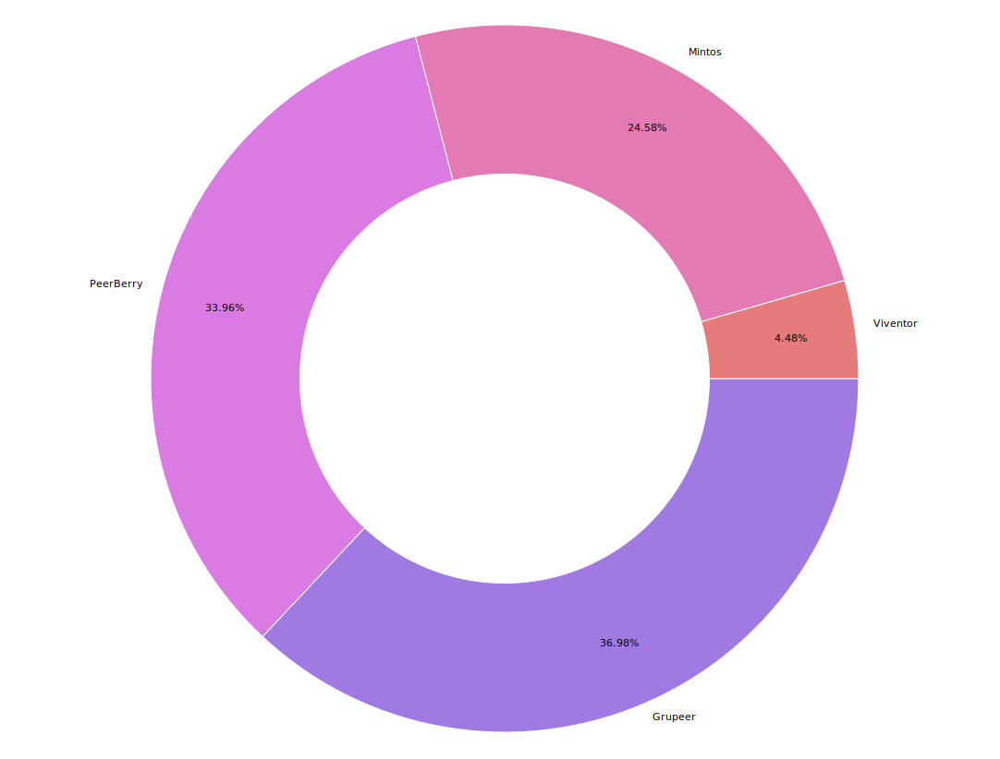
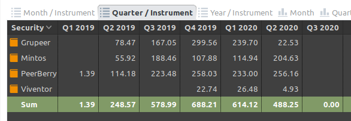
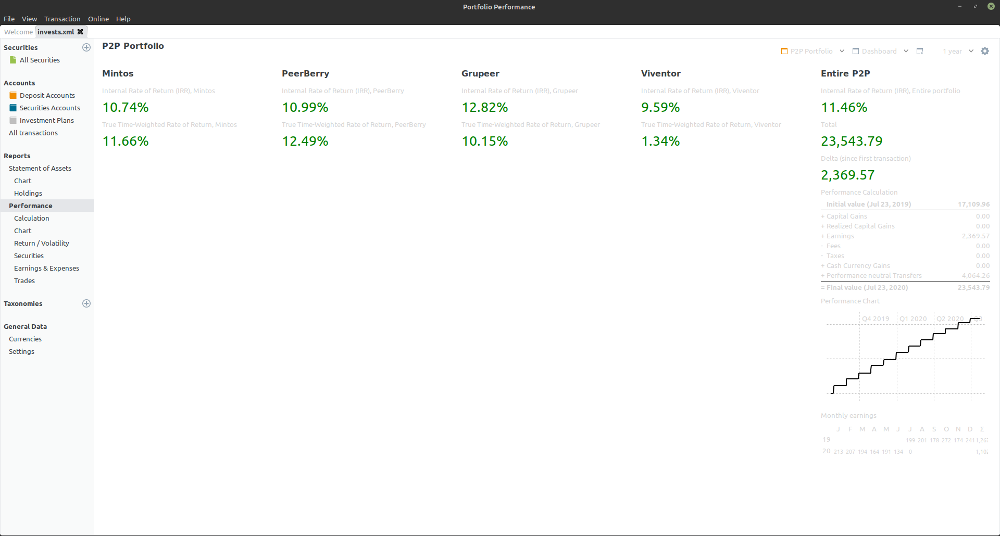

In this post, I will share my portfolio size, diversity, average interest per platform, and IRR (Internal Rate of Return) and much more.

I've been wanting to share my thoughts and lessons learned in the P2P market. If I miss some value you would want to see [tweet at me](https://twitter.com/rodrigograca31) and I will add it.

First things first:

## Where do I invest?

<!--  -->

As you can see I only invest in 4 platforms. "Why?", you ask.
Because these are the more well known and trusted ones, not much need for others.
Those are:

- [PeerBerry:](https://peerberry.com/ref/GZZQ89/) 7,996.24€
- [Mintos:](https://www.mintos.com/en/l/ref/114BY3) 5,786.09€
- [Viventor:](https://www.viventor.com/?ref=FM6324) 1,504.15€
- [Grupeer:](https://www.grupeer.com/) 8,707.31€

## My current returns:

First things first, everyone wants to know how much someone can get from their investments in terms of returns, so here are mine per platform, based on 1 year of investments.

### [PeerBerry: ](https://peerberry.com/ref/GZZQ89/)

- Reported Net Annual Return: **12.95%**
- Actual Net Annual Return: **10.99%** (IRR)
- Average monthly income: **85,38€**

### [Mintos](https://www.mintos.com/en/l/ref/114BY3)

- Reported Net Annual Return: **11.89%**
- Actual Net Annual Return: **10.74%** (IRR)
- Average monthly income: **68,21€**

### [Viventor](https://www.viventor.com/?ref=FM6324)

- Reported Net Annual Return: **15.14%** (XIRR)
- Actual Net Annual Return: **1.34%** (IRR)
- \*Average monthly income: **1,34€**

\*Viventor data is a bit skewed because I'm basing it on the last 3 months.

### [Grupeer](https://www.grupeer.com/)

- Reported Net Annual Return: **-%**
- Actual Net Annual Return: **12.82%** (IRR)
- Average monthly income: **22.53€**

Grupeer has been dealing with issues due to the current pandemic (Covid-19) according to them. Others say it is a scam.
I currently don't advise you to invest there.

## Why do I invest in these platforms?

### [PeerBerry:](https://peerberry.com/ref/GZZQ89/)

- Ease of use
- Super-fast withdrawals!
- Auto Invest
- Good returns

### [Mintos:](https://www.mintos.com/en/l/ref/114BY3)

- Well known
- Biggest platform in the EU
- Auto Invest
- Multiple currencies and easy conversion inside the platform itself
- Lots of public data about each LO
- For diversification

### [Viventor:](https://www.viventor.com/?ref=FM6324)

- Ease of use
- For diversification

### [Grupeer:](https://www.grupeer.com/)

- Ease of use
- For diversification
- Good returns

## Which P2P platform do I prefer?

I currently prefer [PeerBerry](https://peerberry.com/ref/GZZQ89/) (7,996.24€ invested).

They are super easy to use, unlike [Mintos:](https://www.mintos.com/en/l/ref/114BY3) there's no "low level" LOs and their withdrawals are super fast! I almost use them as a normal bank. I leave 200€ not invested so that if I need money I can have it in 1 or 2 days.

Did I miss something that you would like me to share? [Tweet at me](https://twitter.com/rodrigograca31) and I will update this article.

## Some extra numbers:

The software I use to keep track of my portfolio is: [Portfolio Performance](https://www.portfolio-performance.info/)
