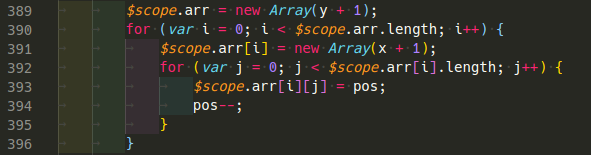
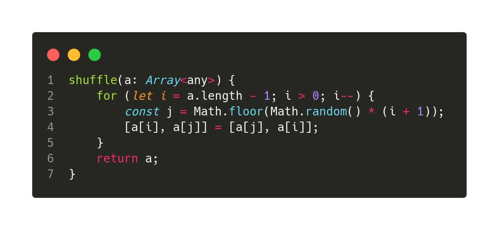

Here is a list of all the extensions I use daily when coding for the web.

They will be ordered by their importance/usage. You should probably install the top ones in case you don't have them!

[Let me know](https://twitter.com/rodrigograca31) if you got an extension that I should definitely be using!

### Table of Contents

1. [Prettier - Code formatter](#prettier---code-formatter)
1. [TabNine](#tabnine)
1. [Code Spell Checker](#code-spell-checker)
1. [indent-rainbow](#indent-rainbow)
1. [Bracket Pair Colorizer 2](#bracket-pair-colorizer-2)
1. [Re-run Last Command](#re-run-last-command)
1. [JavaScript Test Runner](#javascript-test-runner)
1. [EditorConfig for VS Code](#editorconfig-for-vs-code)
1. [Add jsdoc comments](#add-jsdoc-comments)
1. [canvas-snippets](#canvas-snippets)
1. [Code Runner](#code-runner)
1. [Latest TypeScript and Javascript Grammar](#latest-typescript-and-javascript-grammar)
1. [CodeSnap](#codesnap)
1. [DotENV](#dotenv)
1. [ESLint](#eslint)
1. [Fast Arrow](#fast-arrow)
1. [GitLens — Git supercharged](#gitlens--git-supercharged)
1. [GraphQL for VSCode](#graphql-for-vscode)
1. [JavaScript (ES6) code snippets](#javascript-es6-code-snippets)
1. [Jest Snippets](#jest-snippets)
1. [Markdown Preview Github Styling](#markdown-preview-github-styling)
1. [Path Intellisense](#path-intellisense)
1. [Portuguese - Code Spell Checker](#portuguese---code-spell-checker)
1. [Python](#python)
1. [Sass](#sass)
1. [Settings Sync](#settings-sync)
1. [SQLite](#sqlite)
1. [Toggle Format on Save](#toggle-format-on-save)
1. [Visual Studio IntelliCode](#visual-studio-intellicode)
1. [vscode-icons](#vscode-icons)
1. [vscode-pigments](#vscode-pigments)
1. [vscode-styled-components](#vscode-styled-components)
1. [Auto Hide](#auto-hide)

### Prettier - Code formatter

**Why:** This is my number one extension! It helps so much! It formats your code for better readability, you can change your settings to format as soon as you paste or save your code. You can basically know if your code will run or not as soon as you save it. If it formats your code correctly you know its valid code and there's no missing brackets or something like that. It also helps you be in sync with the global community or your fellow coworkers by keeping everyone's code with the same style.

**Install:** `ext install esbenp.prettier-vscode`

**Description:** Code formatter using prettier

**VS Marketplace Link**: https://marketplace.visualstudio.com/items?itemName=esbenp.prettier-vscode

### TabNine

**Why:** This is my second favorite extension! Its Machine Learning (AI) help for coding. It will blow your mind 🤯. You start writing a function to add 2 numbers and it immediately knows how to finish said function. You have to try it! Its really 🤯.

**Install:** `ext install tabnine.tabnine-vscode`

**Description:** All-language autocompleter — TabNine uses machine learning to help you write code faster.

**VS Marketplace Link**: https://marketplace.visualstudio.com/items?itemName=TabNine.tabnine-vscode

### Code Spell Checker

**Why:** This one is a must-have even if you are a native English speaker because it even corrects the spelling on variables. Let's say you make a function called `sumTwoNumbers` but you misspelled it like so: `sumTwoNubers` it is able to detect each work because of the snake case and warn you that one word is misspelled. It's doing it right now! 😂

**Install:** `ext install streetsidesoftware.code-spell-checker`

**Description:** Spelling checker for source code

**VS Marketplace Link**: https://marketplace.visualstudio.com/items?itemName=streetsidesoftware.code-spell-checker

### indent-rainbow

**Why:** This extension helps me a lot with readability. It gives you different colors for each indentation. As you can see below, I use tabs as 4 spaces and with this extension on top, it makes it easy to understand what's inside what.



**Install:** `ext install oderwat.indent-rainbow`

**Description:** Makes indentation easier to read

**VS Marketplace Link**: https://marketplace.visualstudio.com/items?itemName=oderwat.indent-rainbow

### Bracket Pair Colorizer 2

**Why:** To help with readability. Gives a unique color to matching brackets. It makes coding so much easier.


**Install:** `ext install coenraads.bracket-pair-colorizer-2`

**Description:** A customizable extension for colorizing matching brackets

**VS Marketplace Link**: https://marketplace.visualstudio.com/items?itemName=CoenraadS.bracket-pair-colorizer-2

### Re-run Last Command

**Why:** This one saves me a few clicks! Instead of opening your terminal and typing a command or even hitting the up arrow and then enter you just hit CTRL + F7 and it runs the last command on your terminal. You don't even need to open the terminal. That means you can stay focused on your code and have a given command running in the background. I use it a lot to deploy ionic/cordova apps I make some modifications and hit the shortcut and it usually runs `ionic cordova run android --device`

**Install:** `ext install cameron.rerun-last-command`

**Description:** Quickly re-run your last command in the integrated terminal.

**VS Marketplace Link**: https://marketplace.visualstudio.com/items?itemName=Cameron.rerun-last-command

### JavaScript Test Runner

**Why:** Because the syntax to run a single JEST test sucks, you have to type the name of the test into the console as a string... That's not user friendly. This extension adds a simple "button" (codelens) above the test that executes that single test. This helps a lot when one of your tests is failing and you want to run only that single test.

**Install:** `ext install oshri6688.javascript-test-runner`

**Description:** Run JavaScript tests easily using CodeLens.

**VS Marketplace Link**: https://marketplace.visualstudio.com/items?itemName=oshri6688.javascript-test-runner

### EditorConfig for VS Code

**Why:** It reads the `.editorconfig` files and overrides user/workspace settings.

**Install:** `ext install editorconfig.editorconfig`

**Description:** EditorConfig Support for Visual Studio Code

**VS Marketplace Link**: https://marketplace.visualstudio.com/items?itemName=EditorConfig.EditorConfig

### Add jsdoc comments

**Why:** It adds jsdoc comments as an option to the autocomplete when it detects you are above a function/class. When the comment is added automatically adds the parameters that a given function will accept.

**Install:** `ext install stevencl.adddoccomments`

**Description:** Adds jsdoc @param and @return tags for selected function signatures in JS and TS

**VS Marketplace Link**: https://marketplace.visualstudio.com/items?itemName=stevencl.addDocComments

### canvas-snippets

**Why:** Because VS Code autocomplete doesn't include the HTML5 canvas API. If you want to do something as simple as `drawImage` you will have to open the documentation. This extension provides all the API options in the autocomplete.

**Install:** `ext install hollowtree.canvas-snippets`

**Description:** A Canvas(JavaScript) Snippets Extension

**VS Marketplace Link**: https://marketplace.visualstudio.com/items?itemName=hollowtree.canvas-snippets

### Code Runner

**Why:** For when you are coding something and you need to test it really quickly. You can select it and hit `Run code`. It will auto-detect the language and execute the code accordingly. For example, `ts-node` for typescript and `node` for javascript.

**Install:** `ext install formulahendry.code-runner`

**Description:** Run C, C++, Java, JS, PHP, Python, Perl, Ruby, Go, Lua, Groovy, PowerShell, CMD, BASH, F#, C#, VBScript, TypeScript, CoffeeScript, Scala, Swift, Julia, Crystal, OCaml, R, AppleScript, Elixir, VB.NET, Clojure, Haxe, Obj-C, Rust, Racket, Scheme, AutoHotkey, AutoIt, Kotlin, Dart, Pascal, Haskell, Nim,

**VS Marketplace Link**: https://marketplace.visualstudio.com/items?itemName=formulahendry.code-runner

### Latest TypeScript and Javascript Grammar

**Why:** The name says it all. If you write JavaScript you should be taking advantage of the latest and greatest features of the language.

**Install:** `ext install ms-vscode.typescript-javascript-grammar`

**Description:** This is development branch of VSCode JS/TS colorization. Please file any issues you find against https://github.com/Microsoft/TypeScript-TmLanguage/issues

**VS Marketplace Link**: https://marketplace.visualstudio.com/items?itemName=ms-vscode.typescript-javascript-grammar

### CodeSnap

**Why:** To create beautiful code snapshots like:



**Install:** `ext install adpyke.codesnap`

**Description:** 📷 Take beautiful screenshots of your code

**VS Marketplace Link**: https://marketplace.visualstudio.com/items?itemName=adpyke.codesnap

### DotENV

**Why:** VSCode .env syntax highlighting. All said.

**Install:** `ext install mikestead.dotenv`

**Description:** Support for dotenv file syntax

**VS Marketplace Link**: https://marketplace.visualstudio.com/items?itemName=mikestead.dotenv

### ESLint

**Why:** Because so many projects use ESLint and it will tell you if you are breaking rules while you write code.

**Install:** `ext install dbaeumer.vscode-eslint`

**Description:** Integrates ESLint JavaScript into VS Code.

**VS Marketplace Link**: https://marketplace.visualstudio.com/items?itemName=dbaeumer.vscode-eslint

### Fast Arrow

**Why:** If you code ES6 you know its a pain to write `() => {}` because it requires you to hit multiple keys. This extension solves that by giving you text expansion for arrow functions.

**Install:** `ext install vinliao.fast-arrow`

**Description:** Write an arrow function in less than 1 second

**VS Marketplace Link**: https://marketplace.visualstudio.com/items?itemName=vinliao.fast-arrow

### GitLens — Git supercharged

**Why:** Mostly for git quick git blame that shows up on each line you are about to modify. It helps me know what was my last change on that line.

**Install:** `ext install eamodio.gitlens`

**Description:** Supercharge the Git capabilities built into Visual Studio Code — Visualize code authorship at a glance via Git blame annotations and code lens, seamlessly navigate and explore Git repositories, gain valuable insights via powerful comparison commands, and so much more

**VS Marketplace Link**: https://marketplace.visualstudio.com/items?itemName=eamodio.gitlens

### GraphQL for VSCode

**Why:** Since I started using GatsbyJS I needed GraphQL syntax highlighting in my editor so that I could make modifications and know if it was valid syntax or not.

**Install:** `ext install kumar-harsh.graphql-for-vscode`

**Description:** GraphQL syntax highlighting, linting, auto-complete, and more!

**VS Marketplace Link**: https://marketplace.visualstudio.com/items?itemName=kumar-harsh.graphql-for-vscode

### JavaScript (ES6) code snippets

**Why:** I don't use this one that much but it helps with things like the ES6 imports.

**Install:** `ext install xabikos.javascriptsnippets`

**Description:** Code snippets for JavaScript in ES6 syntax

**VS Marketplace Link**: https://marketplace.visualstudio.com/items?itemName=xabikos.JavaScriptSnippets

### Jest Snippets

**Why:** To help me write tests. It provides me with the correct syntax for `describe`, `it`, etc

**Install:** `ext install andys8.jest-snippets`

**Description:** Code snippets for testing framework Jest

**VS Marketplace Link**: https://marketplace.visualstudio.com/items?itemName=andys8.jest-snippets

### Markdown Preview Github Styling

**Why:** I write lots of markdown and in some cases, the native VS Code preview isn't accurate enough. I use this extension to fix that.

**Install:** `ext install bierner.markdown-preview-github-styles`

**Description:** Changes VS Code's built-in markdown preview to match Github's style

**VS Marketplace Link**: https://marketplace.visualstudio.com/items?itemName=bierner.markdown-preview-github-styles

### Path Intellisense

**Why:** As the name says it helps with paths. From imports to `src` attributes and other needed paths.

**Install:** `ext install christian-kohler.path-intellisense`

**Description:** Visual Studio Code plugin that autocompletes filenames

**VS Marketplace Link**: https://marketplace.visualstudio.com/items?itemName=christian-kohler.path-intellisense

### Portuguese - Code Spell Checker

**Why:** I use this one in conjunction with the main Code Spell Checker plugin because I'm Portuguese and sometimes I have sentences written in Portuguese in my own code. Maybe I should stop that...? 🤔🤷🏻‍♂️

**Install:** `ext install streetsidesoftware.code-spell-checker-portuguese`

**Description:** Portuguese dictionary extension for VS Code.

**VS Marketplace Link**: https://marketplace.visualstudio.com/items?itemName=streetsidesoftware.code-spell-checker-portuguese

### Python

**Why:** 🐍 Support.

**Install:** `ext install ms-python.python`

**Description:** Linting, Debugging (multi-threaded, remote), Intellisense, Jupyter Notebooks, code formatting, refactoring, unit tests, snippets, and more.

**VS Marketplace Link**: https://marketplace.visualstudio.com/items?itemName=ms-python.python

### Sass

**Why:** Sass support. 🤷🏻‍♂️ Because Sass is awesome.

**Install:** `ext install syler.sass-indented`

**Description:** Indented Sass syntax Highlighting, Autocomplete & Formatter

**VS Marketplace Link**: https://marketplace.visualstudio.com/items?itemName=Syler.sass-indented

### Settings Sync

**Why:** To sync all my settings and extensions to the could (GitHub Gists) so that if something happens I'm safer.

**Install:** `ext install shan.code-settings-sync`

**Description:** Synchronize Settings, Snippets, Themes, File Icons, Launch, Keybindings, Workspaces and Extensions Across Multiple Machines Using GitHub Gist.

**VS Marketplace Link**: https://marketplace.visualstudio.com/items?itemName=Shan.code-settings-sync

### SQLite

**Why:** To open and query SQLite databases. It shows you the tables and, etc.

**Install:** `ext install alexcvzz.vscode-sqlite`

**Description:** Explore and query SQLite databases.

**VS Marketplace Link**: https://marketplace.visualstudio.com/items?itemName=alexcvzz.vscode-sqlite

### Toggle Format on Save

**Why:** As the name suggests, it toggles the "Format on Save" setting. I use this for when I'm editing some project that is not using `Prettier - Code formatter` and I don't want to reformat a given file. I temporarily disable it and then re-enable it after I saved the file.

**Install:** `ext install cbrevik.toggle-format-on-save`

**Description:** Provides a command to toggle Format on Save

**VS Marketplace Link**: https://marketplace.visualstudio.com/items?itemName=cbrevik.toggle-format-on-save

### Visual Studio IntelliCode

**Why:** Another extension with AI incorporated into. It helps me with Python, TypeScript, and JavaScript. Instead of having an alphabetically ordered list of methods/options, it gives me the ones I'm most likely to use at a given time.

**Install:** `ext install visualstudioexptteam.vscodeintellicode`

**Description:** AI-assisted development

**VS Marketplace Link**: https://marketplace.visualstudio.com/items?itemName=VisualStudioExptTeam.vscodeintellicode

### vscode-icons

**Why:** There's many icon extensions but this one is the one I identify with and can easily recognize the icons. That said I made all folders have the default icon and hide the explorer arrows.

```json
"vsicons.presets.foldersAllDefaultIcon": true,
"vsicons.presets.hideExplorerArrows": true
```

**Install:** `ext install vscode-icons-team.vscode-icons`

**Description:** Icons for Visual Studio Code

**VS Marketplace Link**: https://marketplace.visualstudio.com/items?itemName=vscode-icons-team.vscode-icons

### vscode-pigments

**Why:** If you write CSS you need this extension. It shows you the color a given rgb or hex value represents.

**Install:** `ext install jaspernorth.vscode-pigments`

**Description:** Previews colors used inside the editor

**VS Marketplace Link**: https://marketplace.visualstudio.com/items?itemName=jaspernorth.vscode-pigments

### vscode-styled-components

**Why:** I hate styled-components but its an industry-standard so I have to work with it when necessary. Because of that, I installed this extension.

**Install:** `ext install jpoissonnier.vscode-styled-components`

**Description:** Syntax highlighting for styled-components

**VS Marketplace Link**: https://marketplace.visualstudio.com/items?itemName=jpoissonnier.vscode-styled-components

### XML

**Why:** XML support. Syntax highlighting, code completion, etc

**Install:** `ext install redhat.vscode-xml`

**Description:** XML Language Support by Red Hat

**VS Marketplace Link**: https://marketplace.visualstudio.com/items?itemName=redhat.vscode-xml

### Auto Hide

**Why:** I hate that the left panel (sidebar) doesn't auto-close. CTRL + B does the trick but doesn't work if you have the terminal focused, and also doesn't get rid of the terminal. By using this extension as soon as I click on my code it virtually goes firescreen. All panels disappear.

**Install:** `ext install sirmspencer.vscode-autohide`

**Description:** A tool to autohide the sidebar and terminal panel.

**VS Marketplace Link**: https://marketplace.visualstudio.com/items?itemName=sirmspencer.vscode-autohide

#### Conclusion:

That's it! All the extensions I use. You should be using at least the top 5 to increase your code quality and productivity.

I might add a big one in the future for flutter development... 🤔
