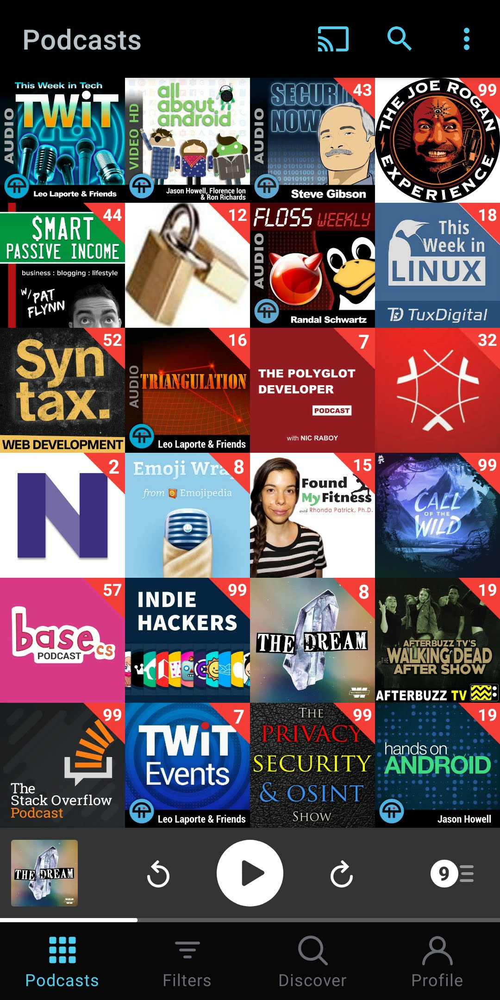

I'm an avid podcast consumer and I currently listen to 24 podcasts 😱 that I curated over the years. "Why?", you ask. Because they save me time because I can be listening to something while I do other "mindless" tasks like cooking/cleaning.

**My top 5:** This week in tech, Security Now, Joe Rogan, Syntax and Found My Fitness.

**Technology:** This Week in Tech, Triangulation, Indie Hackers, Twit Events, and Smart Passive Income.

**Programming:** This Week in Tech, Syntax (Web Dev), Security Now, and StackOverflow Podcast.

**Security:** Security Now, Crypto-Gram Security, and The privacy, Security, & OSINT Show.

Here is my list:

1. [This Week in Tech](#this-week-in-tech)
1. [All About Android](#all-about-android)
1. [Security Now](#security-now)
1. [The Joe Rogan Experience](#the-joe-rogan-experience)
1. [Smart Passive Income](#smart-passive-income)
1. [Crypto-Gram Security](#crypto-gram-security)
1. [FLOSS Weekly](#crypto-gram-security)
1. [This Week in Linux](#this-week-in-linux)
1. [Syntax](#syntax)
1. [Triangulation](#triangulation)
1. [The Polyglot Developer](#the-polyglot-developer)
1. [Podcasts from Adobe Experience Cloud](#podcasts-from-adobe-experience-cloud)
1. [“Narro.co”](#narroco)
1. [Emoji Wrap](#emoji-wrap)
1. [Found My Fitness](#found-my-fitness)
1. [Monstercat: Call of the Wild](#monstercat-call-of-the-wild)
1. [Base.cs](#basecs)
1. [Indie Hackers](#indie-hackers)
1. [The Dream](#the-dream)
1. [The Walking Dead - AfterBuzzz TV](#the-walking-dead---afterbuzzz-tv)
1. [The Stack Overflow Podcast](#the-stack-overflow-podcast)
1. [TWiT Events](#twit-events)
1. [The privacy, Security, & OSINT Show](#the-privacy-security--osint-show)
1. [Hands-On Android](#hands-on-android)

<!--
| name | type | why | schedule | link |
| ---- | ---- | --- | -------- | ---- |
| aa   | aa   | aaa | aaa      | aaa  |
| bbb  | bbb  | bbb | bbb      | bbb  |
|      |      |     |          |      | -->

### This Week in Tech

**Type:** Audio

**Why I listen:** It's the oldest and probably more well-known tech Podcast, every Monday morning I have a new episode about last week's tech industry. This way I stay current with tech and don't have to read.

**Duration:** 2-3 Hours

**Publishing schedule:** Weekly - Monday

**Hosts:** Leo Laport and well-known guests from the tech world

**Link:** [https://pca.st/twit](https://pca.st/twit)

### All About Android

**Type:** Video

**Why I listen:** I'm an app developer so I like to know how the Android platform is doing. They talk about new phones, new/cool applications, new Android versions, and their new features, they have guests on from Google and other big Android sites. There is also an audio-only version.

**Duration:** 1.5 hours

**Publishing schedule:** Weekly - Wednesday

**Hosts:** Jason Howell, Florence Ion, Ron Richards and guests

**Link:** [https://pca.st/aQDi](https://pca.st/aQDi)

### Security Now

**Type:** Audio

**Why I listen:** To keep up with the security news/world. This is the oldest and more well-known security podcast. Every week Steve Gibson discusses and explains the security news of the previous week.
He has also explained various security topics in huge detail, from password managers to hashing.
He also enjoys and shares some wisdom in the health field.

**Duration:** 2 hours

**Publishing schedule:** Weekly - Wednesday

**Hosts:** Steve Gibson and Leo Laport

**Link:** [https://pca.st/secn](https://pca.st/secn)

### The Joe Rogan Experience

**Type:** Audio

**Why I listen:** "To expand my wisdom". I don't even know how to explain. If you don't know Joe Rogan you are in for a treat. Its probably considered the number 1 podcast in the world. He has had guests like Elon Musk, Dr. Rhonda Patrick, Mike Tyson, Neil DeGrasse Tyson, Tim Ferriss, and many other well-known people. His topics range from health, philosophy, science, comedy, to virtually any topic. He sits down and talks to his guests for hours.

**Duration:** 2-3 Hours

**Publishing schedule:** Daily

**Hosts:** Joe Rogan

**Link:** [https://pca.st/joerogan](https://pca.st/joerogan)

### Smart Passive Income

**Type:** Audio

**Why I listen:** I would say this is the number 1 podcast if you are into blogging, marketing, passive income, online business, affiliates, podcasting, etc. Pat Flynn has been a great inspiration throughout the years. He brings guests on to talk about how and what they are doing to provide value in their niche. His site content has been a fantastic resource over the years if you do online business. (It's a birds-eye view)

**Duration:** 1 hour

**Publishing schedule:** Weekly - Wednesday

**Hosts:** Pat Flynn and guests

**Link:** [https://pca.st/spipod](https://pca.st/spipod)

### Crypto-Gram Security

**Type:** Audio

**Why I listen:** Another great security podcast. It's a monthly newsletter from Bruce Schneier read by Dan Henage. Bruce Schneier is a very well known cryptographer, computer security. If you are interested in security you probably hear his name before.

**Duration:** 15 - 30 Minutes

**Publishing schedule:** Monthly

**Hosts:** "Bruce Schneier" (read by Dan Henage)

**Link:** [https://pca.st/podcast/d6f36a10-1dfa-012e-01d4-00163e1b201c](https://pca.st/podcast/d6f36a10-1dfa-012e-01d4-00163e1b201c)

### FLOSS Weekly

**Type:** Audio

**Why I listen:** Like the name says every week they talk about FLOSS (Free Libre Open Source Software). Usually, they bring a project or a person on and ask all kinds of questions like "How the project is structured?", "How it's funded?", "What's the license?", "Who is it for?", "How they do it?", "How it was started?", "Whos behind?", "What they currently need help with?". This allows me to discover new projects/tools that I would not otherwise. Also keeps me up to date on what people are doing and using.

**Duration:** 1 Hour

**Publishing schedule:** Weekly - Wednesday

**Hosts:** Various people known in the Open Source community

**Link:** [https://pca.st/flo](https://pca.st/flo)

### This Week in Linux

**Type:** Audio

**Why I listen:** Once again like the name says every week the host talks about the previous week news in the Linux world. Things like new package versions, distro updates, new Linux hardware, etc. I mostly listen to know about new features in packages or Linux distributions.

**Duration:** 1 Hour

**Publishing schedule:** Weekly - Wednesday

**Hosts:** Michael Tunnell

**Link:** [https://pca.st/3L6v](https://pca.st/3L6v)

### Syntax

**Type:** Audio

**Why I listen:** I listen to keep up with what and how people are doing Web Development nowadays. They pick one topic and discuss it, analyzing the alternatives, how they do it, and why. They also answer lots of general web dev questions that viewers send. If you are a web developer this is the number 1 podcast. Scott Tolinski and Wes Bos are 2 very well known developers in the JavaScript world. They have multiple courses that range from free to paid.

**Duration:** 30 Minutes to 1 Hour

**Publishing schedule:** Monday and Wednesday

**Hosts:** Scott Tolinski and Wes Bos

**Link:** [https://pca.st/fmx9](https://pca.st/fmx9)

### Triangulation

**Type:** Audio

**Why I listen:** A bit like the Joe Rogan podcast, Triangulation is a podcast where the host interviews interesting people like book authors, mathematicians, scientists. (No longer produced 😢)

**Duration:** 1 Hour

**Publishing schedule:** Weekly - Not publishing anymore

**Hosts:** Various people from TWiT

**Link:** [https://pca.st/GKBE](https://pca.st/GKBE)

### The Polyglot Developer

**Type:** Audio

**Why I listen:** Monthly

**Duration:** 1 Hour

**Publishing schedule:** This is another must-listen podcast if you are a Web Developer. The host talks about web dev, mobile, etc. If you have done angular 1.0 you probably crossed his blog articles. As of late, he has brought guests and asked questions ELI5 (Explain Like I'm 5) style about various technologies related to web development.

**Hosts:** Nic Raboy

**Link:** [https://pca.st/qXBc](https://pca.st/qXBc)

### Podcasts from Adobe Experience Cloud

**Type:** Audio

**Why I listen:** If you do or like marketing this podcast is a great resource. It's a series of "white papers" about marketing topics. Great information from a big company.

**Duration:** 15 - 30 Minutes

**Publishing schedule:** No schedule, a few times a month

**Hosts:** Adobe Experience Cloud

**Link:** [https://pca.st/1hWp](https://pca.st/1hWp)

### "Narro.co"

**Type:** Audio

**Why I listen:** This one is a very special "podcast". Like I mentioned in my ["How to be a 10x developer"](/how-to-be-a-10x-developer/#use-tts-text-to-speech) article Narro.co is **your podcast**. It turns any article into audio and gives you a podcast feed as output. That means you have a custom podcast where each episode is an article you chose turned into audio so that you can listen later while doing other misc tasks! How awesome is that!?

**Duration:** 🤷🏻‍♂️

**Publishing schedule:** 🤷🏻‍♂️

**Hosts:** "You"

**Link:** The link will be different for everyone. Sign up for [Narro.co](https://www.narro.co/) and get the link from them.

### Emoji Wrap

**Type:** Audio

**Why I listen:** A podcast about emojis. Why? 🤔 Because I love expressing my self with emojis. 🤷🏻‍♂️ Plain text is boring. Emojis bring color and expressions to text. I like to know what emojis are coming and whats currently supported. I'm still waiting for the Mars emoji! 😠

**Duration:** 1 Hour

**Publishing schedule:** Monthly

**Hosts:** Emojipedia

**Link:** [https://pca.st/emojiwrap](https://pca.st/emojiwrap)

<!-- ### Foundering (Decrypted)

**Type:**

**Why I listen:** Formely know as "Decrypted" is a podcast from Bloomberg, one of the biggest news sites for "business and markets news, data, analysis, and video". Its basically a technology drama podcast. As of late they changed name to Foundering and are covering the "disaster" that WeWork is.

**Duration:**

**Publishing schedule:**

**Hosts:**

**Link:** [https://pca.st/](https://pca.st/) -->

### Found My Fitness

**Type:** Audio

**Why I listen:** This podcast is a really good resource about the latest in the medical, fitness, and science fields. From cutting edge research to her team research. Like the description says "Promoting strategies to increase healthspan, well-being, cognitive and physical performance....". If you have listened to the Joe Rogan Podcast you probably came across Rhonda Patrick being interviewed by him.

**Duration:** 1 Hour

**Publishing schedule:** Monthly

**Hosts:** Dr. Rhonda Patrick

**Link:** [https://pca.st/fmf](https://pca.st/fmf)

### Monstercat: Call of the Wild

**Type:** Audio (music)

**Why I listen:** I don't listen to much music on my phone and when I do is streamed from YouTube or other apps and that requires lots of data. Because of that I use this feed when I know I will be outside with no data and I want to hear some music. Also keeps me up with new music releases from artists I like. The music style is EDM/Electronic

**Duration:** 1 Hour

**Publishing schedule:** Weekly - Wednesday

**Hosts:** Monstercat

**Link:** [https://pca.st/TmUC](https://pca.st/TmUC)

### Base.cs

**Type:** Audio

**Why I listen:** To expand my knowledge of CS (Computer Science). They have covered all the basic concepts of CS throughout the years.

**Duration:** 30 Minutes

**Publishing schedule:** Weekly

**Hosts:** CodeNewbie

**Link:** [https://pca.st/yWt4](https://pca.st/yWt4)

<!-- ### RadioLab

**Type:**

**Why I listen:** Honestly I dont listen to this one that often anymore but they have interesting topics

**Duration:**

**Publishing schedule:**

**Hosts:**

**Link:** [https://pca.st/](https://pca.st/) -->

### Indie Hackers

**Type:** Audio

**Why I listen:** If you like online business this is another must-listen podcast. The host interviews hundreds of people that have built their revenue-generating machines online

**Duration:** 1 Hour

**Publishing schedule:** Twice a month?

**Hosts:** Courtland Allen

**Link:** [https://pca.st/EnbQ](https://pca.st/EnbQ)

### The Dream

**Type:** Audio

**Why I listen:** To keep up with the online scams, they are everywhere. Season one was all about [MLMs](https://en.wikipedia.org/wiki/Multi-level_marketing), season 2 is about "Wellness" (crystals, oils, etc)

**Duration:** 30 Minutes to 1 Hour

**Publishing schedule:** Weekly

**Hosts:** Little Everywhere & Witness Docs

**Link:** [https://pca.st/w5xh](https://pca.st/w5xh)

<!-- ### Apps, Games, Insights

**Type:**

**Why I listen:** A podcast for those in the apps and games industry. From Google themselves. It discusses the best ways of engaging users, app privacy, better user experiences, and other topics.

**Duration:**

**Publishing schedule:**

**Hosts:**

**Link:** [https://pca.st/](https://pca.st/) -->

### The Walking Dead - AfterBuzz TV

**Type:** Audio

**Why I listen:** Sometimes after watching an episode of The Walking Dead I if didn't get something or just would like to hear someones opinion on what happened or will happen I listen to this podcast that discusses every episode a few hours after has aired. The AfterBuzz TV network has multiple shows dedicated to every series, so if you want to hear a discussion about your favorite series, search for it!

**Duration:** 30 Minutes to 1 Hour

**Publishing schedule:** When a new TV episode is out

**Hosts:** AfterBuzz TV

**Link:** [https://pca.st/Ezqz3s](https://pca.st/Ezqz3s)

### The Stack Overflow Podcast

**Type:** Audio

**Why I listen:** If you are into technology you know StackOverflow. This podcast is a conversation about working in software development, learning to code, and art/culture of computer programming.

**Duration:** 15 - 30 minutes

**Publishing schedule:** Twice a week Tuesdays and Fridays

**Hosts:** Various people from StackOverflow

**Link:** [https://pca.st/dRBh](https://pca.st/dRBh)

### TWiT Events

**Type:** Video

**Why I listen:** I mostly subscribe to this podcast so that when the [TWiT](https://twit.tv/) network has an event covering like WWDC, CES, etc I can watch them commenting on the event.

**Duration:** 1 - 2 Hours

**Publishing schedule:** When there's an event covering. 🤷🏻‍♂️

**Hosts:** Leo Laport and friends

**Link:** [https://pca.st/u6ch6url](https://pca.st/u6ch6url)

### The privacy, Security, & OSINT Show

**Type:** Audio

**Why I listen:** This is a new podcast that I recently found after learning about the term [OSINT](https://pt.wikipedia.org/wiki/OSINT). Because of my love for security, I knew of many of these tricks/tools/topics but wasn't aware of an entire industry around them.

**Duration:** 1 Hour

**Publishing schedule:** Weekly - Friday

**Hosts:** Michael Bazzell

**Link:** [https://pca.st/zdiq](https://pca.st/zdiq)

### Hands-On Android

**Type:** Audio

**Why I listen:** Short form and topic-specific. From tips and tricks to apps. The host dives deep into new Android features or ways of doing something on the Android Platform.

**Duration:** 15 Minutes

**Publishing schedule:** Weekly - Thursday

**Hosts:** Jason Howell

**Link:** [https://pca.st/wh8t45oa](https://pca.st/wh8t45oa)

---

Note: I don't listen to all episodes of all podcasts. That would be impossible.

[If you want all my podcasts as an OPML file here it is.](./podcasts_opml.xml)

The App I use to listen is [Pocket Casts](https://www.pocketcasts.com/)

**Pro tips:**

1. Enable "Trim Silence". (It has saved me 15 hours so far! 😮)

2. Increase the "Speed" setting. I got it at 1.1x. This also saves you hours!

3. Enable "Auto download" and "Add to Up Next" on the podcasts you love and every morning they will be downloaded and on your playlist ready to be played.

4. Use a widget to have quick access to your player. This allows you to start listening without having to open the App first.

Hopefully, you have discovered some new podcasts to listen to! [Tweet at me](https://twitter.com/rodrigograca31) the podcasts you listen to!

<!--
**Type:**

**Why I listen:**

**Duration:**

**Publishing schedule:**

**Hosts:**

**Link:** [https://pca.st/](https://pca.st/) -->
